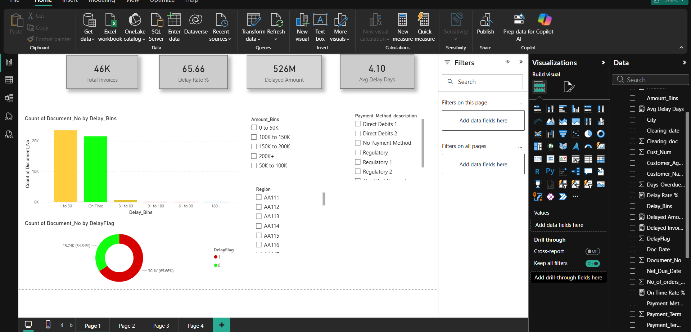
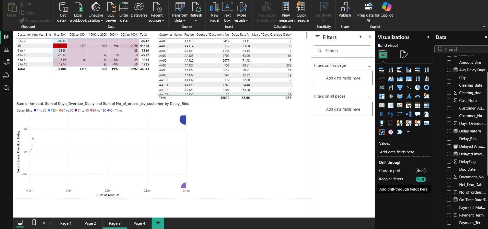

# SME-payment-analysis
SME Invoice Payment Delay Analytics |     MySQL + Python + Power BI

# SME Invoice Payment Delay Analytics

> **Razorpay Fix My Itch Verified Problem**  
> "Why can't SMEs negotiate favorable payment 
> terms with large buyers?" — Itch Score: 82.8

---

## Project Overview
End-to-end analytics project analyzing 45,839 real 
B2B invoice transactions to identify payment delay 
patterns and build a delay prediction model.

## Tech Stack
| Tool | Purpose |
|------|---------|
| MySQL | Data storage + 7 business queries |
| Python (Pandas, Scikit-learn) | EDA + ML Model |
| Power BI | 4-page interactive dashboard |

## Key Findings
- **65.6%** of all invoices are delayed
- Direct Debit is most reliable payment method
- New customers (0-2 yr) delay 2x more than old
- Q4 has highest invoice concentration

## Dashboard Preview

### Page 1 — Executive Summary

### Page 2 — Payment Method Analysis  

### Page 3 — Risk Heatmap

### Page 4 — Recommendations

## Recommendations
1. Automated reminders → 15-20% delay reduction
2. Direct Debit incentive program
3. Shorter payment terms for new customers
4. Q4 early payment discount

## Repository Structure
